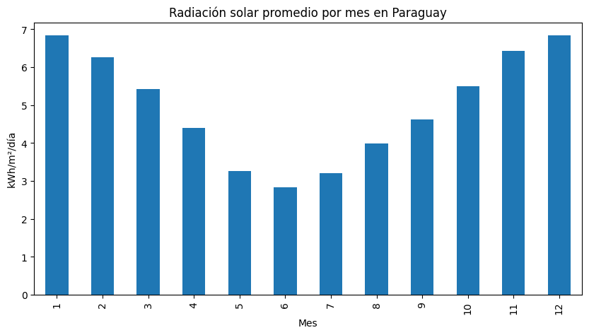
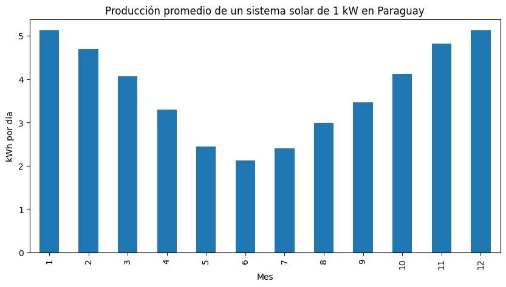

# Análisis de Energía Solar en Paraguay

##  Contexto

Paraguay cuenta con un alto potencial de energía solar debido a su ubicación geográfica. Este proyecto de práctica busca analizar datos históricos de radiación solar (2010-2024) para evaluar la viabilidad del uso de paneles solares en el consumo energético residencial.

## Descripción
Este proyecto analiza datos de radiación solar en Paraguay para estudiar su comportamiento a lo largo del tiempo y evaluar su potencial para el aprovechamiento de energía solar.

## Objetivos
- Analizar la radiación solar en Paraguay
- Identificar los meses con mayor potencial solar
- Estimar posibles beneficios energéticos
- Presentar los resultados de forma visual

## Tecnologías utilizadas
- Python
- Pandas
- NumPy
- Matplotlib
- Jupyter Notebook

## Archivos del proyecto
-`proyecto_ESPy.ipynb`
-`solar_paraguay_limpio.csv`

##  Resultados

##  Supuestos del análisis

- Consumo promedio residencial: 300 kWh/mes
- Tarifa eléctrica basada en tarifa residencial en Paraguay
- Datos históricos utilizados como base para estimación

##  Conclusiones

- Se observa un patrón estacional claro en la radiación solar en Paraguay.
- Los meses entre octubre y marzo presentan los valores más altos.
- Esto indica un alto potencial para la implementación de energía solar en el país.
- Para un consumo promedio de 300 kWh mensual, el uso de paneles solares podría representar un ahorro significativo en la factura eléctrica.

##  Próximas mejoras

- Incluir más variables climáticas
- Modelos de predicción de generación solar
- Simulación para diferentes tipos de usuarios (PYMES, sector público y privado)

##  Documentación completa

Podés visualizar el informe completo del proyecto aquí:

[ [ Descargar informe en PDF](docs/informe_proyecto.pdf)
## Autor
Fatima Arana
